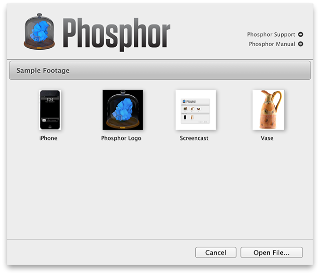
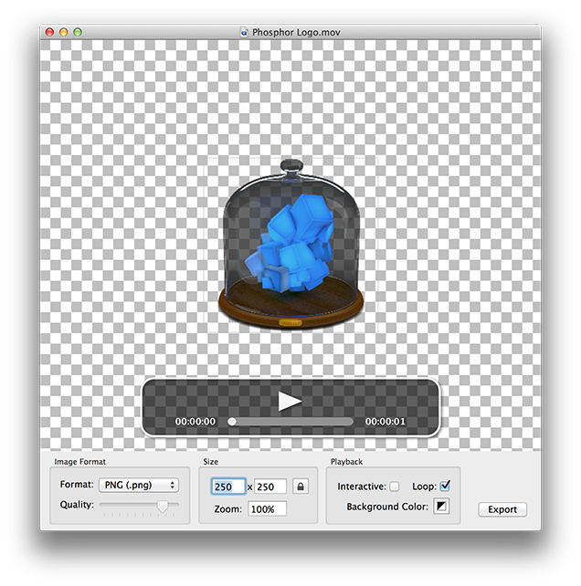

# **1** Welcome to Phosphor #

## Welcome ##

Phosphor is a new way of bringing animation and video to the web.  Starting with a standard QuickTime file, Phosphor creates crossplatform, web-standards compliant assets which can be played on desktop and mobile devices without plugins or even video decoding capabilities.  As long as a browser supports JavaScript and the ability to show images, it can display Phosphor content.

Using Phosphor is simple and fun.  This manual will walk you through the basics, and will explore the situations in which Phosphor is most appropriate.

# **2** Getting Started #

## Interface Basics ##

Upon launch, Phosphor displays a grid of previously accessed media, as well as an assortment of sample source material.  If you’re still in the process of getting familiar with Phosphor, the sample media gives you the opportunity to begin experimenting immediately.  You can use the “open” button (or select open from the file menu) to open any other modern QuickTime movie on your computer.

## Supported Media ##
Phosphor can open most modern QuickTime files, including H.264 and ProRes.  The composition output by Phosphor will be the same resolution as your source movie, so a 1920x1080 source movie will result in a 1920x1080 output.  See chapter three for tips on how to prepare media for Phosphor.

## Exporting ##
Once you’ve loaded your movie into Phosphor, you can adjust a variety of settings, including format, quality, and background color.

### PNG Export ###
PNG files are a good choice for movies which include an alpha layer.  The transparency will be preserved, allowing you to integrate your Phosphor composition with an existing background design on your website.

### JPG Export ###
JPEG files are the best choice for most types of content, as the files are highly compressed and easily worked with.  When working with JPEG files, the quality slider adjusts how heavily compressed the resulting files will be.

### TIFF Export ###
TIFF files are uncompressed, and are not suitable for use directly within a webpage.  Use this option if you’ll be compressing your files separately, using an external tool.

### Interactive Mode ###
Interactive Mode will allow users to scrub back and forth through your composition using their mouse or a touch interface.  This is ideal for product demonstrations and 3d visualizations.  The compositions generated in interactive mode will be larger than non-interactive mode.

### Loop ###
The loop setting will cause your composition to loop when played in a webbrowser.  You can adjust this after exporting by editing the HTML generated by Phosphor.

### Zoom and Sizing ###
If you're working with content captured by a traditional video camera, it's very large.  You can resize your video right within Phosphor, using either the "zoom" adjustment, or by entering height and width values.  The lock icon will allow you to adjust the aspect ratio of your image.

### Background Color ###
If your source media is in the ProRes 4444 format, and contains alpha (transparency) information, you can use the color picker to adjust the background color.  This color will be composited into your image when exporting in the JPEG format, which does not support transparency.  If your target format supports transparency (PNG or TIFF), the transparency in your source video will be preserved.

## The Export Process ##
Once you've made your selections, press the export process to generate your Phosphor output.  Phosphor will analyze your content and figure out the most efficient way to prepare it for delivery.  With a longer movie, this can be time consuming.  

You can work with additional movies within Phosphor during an export - simply select “open” from the “file” menu to begin working on another composition.

# **3** Optimizing Media for Phosphor #

## Types of Source Material ##
Phosphor works best with short movies which do not contain a lot of visual noise.  Visual noise includes things like static on a television screen, a snow storm, or ripping water.  

## Framerate ##
Video typically runs at 30 frames per second.  In many cases, you can achieve fluid motion with a lower framerate, and thus benefit from greater efficiency.  Using your video editing software to convert your media to 15 frames per second will substantially reduce the size of your composition.

## Duration ##
Videos longer than approximately 30 seconds will generally result in large compositions, which may not work well on mobile devices or devices with limited memory.  For these types of content, a more traditional video embed is more appropriate.

## Compressing Phosphor Compositions ##
Phosphor outputs standard image files, in either JPG, PNG or TIFF format.  These files can be modified with traditional image manipulation tools.  For example, the free [ImageOptim](http://imageoptim.com) application can often substantially reduce the size of PNG and JPG files, without an additional reduction in quality.

When editing Phosphor images, it’s important that you don’t resize the images.  If the overall resolution of the file changes, the Phosphor library will no longer be able to display the composition.

# **4** Working with Content on the Web #

## Previewing Content ##
After exporting, you will have access to a folder containing a mix of file types - HTML, JavaScript, JSON and images.  In most cases, double-clicking the index.html file will allow you to preview your composition within your local webbrowser.  Some security configurations or browser settings may prevent you from loading local content within your browser.  In these cases, you may need to adjust a setting or load your content from a traditional webserver.

## Embedding Content ##
The index.html file generated by Phosphor contains a basic scaffolding for your composition, including basic controls.  If you'd like to embed the composition in an existing website, there are a few important items to include.  First, you'll need to include the "jquery" and "phosphorframework" javascript files.  Then, you'll need the "img" tag with the "anim_target" id attached to it.  Finally, you'll need the first few lines of the "script" block:

    $(document).ready(function(){
        player_test = new PhosphorPlayer('anim_target_test');
        phosphorCallback_test = function(data) {

          /**
           * Instantiate the player.  The player supports a variate of callbacks for deeper 
		   * integration into your site.
           */

           framecount = data.frames.length;
           player_test.load_animation({
            imageArray:["test_atlas000.jpg"],
            animationData: data,
            loop: true,
            onLoad: function() {
              player_test.play();
            }
          });
         }
         var jsonpScript = document.createElement("script");
         jsonpScript.type = "text/javascript";
         jsonpScript.id = "jsonPinclude_test";
         jsonpScript.src = "test_animationData.json" + "p";
         document.getElementsByTagName("head")[0].appendChild(jsonpScript);

     });

The other code within the script block enables playback controls and interactivity - you may choose to leave those out, depending on your particular needs.

# **5** Javascript Framework #

The sample HTML generated by Phosphor shows an example of a basic phosphor composition (see Chapter 4).  However, there are further opportunities for customization for users familiar with Javascript development.

## Callbacks ##

The Phosphor Framework has three callbacks which may be specified as parameters on the load_animation function.  These allow you to trigger custom actions based on events which occur within the Phosphor framework.

### currentFrameCallback(frameCount) ###

This callback will be triggered each time a new frame is drawn.  Your function declaration should include one parameter, which will be passed the current framecount.  This count will reset to zero each time the composition repeats.

### onLoad ###

This function will be triggered after all of the images for your composition have successfully been loaded from the server.  Generally, this is used to trigger the play() function.

### playbackFinishedCallback ###

This callback will be triggered each time the last frame in your composition is displayed.  If your composition is set to loop, this will be triggered multiple times.

## Control functions ##

Phosphor exposes a variety of functions for playback control, which you may choose to trigger from your own code.

### play ###

Begins playback of your composition.

### stop ###

Stops playback of your composition.

### debug(boolean) ###

Enables or disable debug overlay.

### loop(boolean) ###

Enables or disables looped playback of the composition.

### (int)currentFrameNumber ###

Get the current frame number.

### setCurrentFrameNumber ###

Jump to a particular frame within the composition.

## Customization ##

The Phosphor Framework is relatively straightforward, and should be easy to customize by developers looking for functionality not available out of the box.  We'd love to see what you build - send us your results at <support@divergentmedia.com>.

# **6** Troubleshooting #

## Compatibility ##
Phosphor compositions should work in any browser that supports the canvas tag.  In some cases, older browsers which do not natively support the canvas tag can gain that support via the [excanvas javascript library](http://excanvas.sourceforge.net).

Running multiple Phosphor compositions on one page may lead to performacne problems on older mobile devices (smartphones) and should be avoided for sites which are likely to be heavily trafficed by mobile browsers.

# **A** Appendix A #

Phosphor makes use of the libjpeg library from the [Independent JPEG Group](http://www.ijg.org).
