#Welcome to ScopeBox 3#

##Welcome##

ScopeBox transforms your Mac into a suite of high-end video analysis tools, replacing a cart full of heavy and expensive components with one simple application.

This manual will walk you through the basics of using ScopeBox, and will also introduce you to some of the theory behind video quality analysis.

For the latest updates, news and support, be sure to visit <http://www.divergentmedia.com/>.

##What's new in ScopeBox 3##

ScopeBox 3 takes the market-leading feature set of ScopeBox 2, and adds a host of new features and enhancements. While introduced here, refer to the appropriate sections later in the manual for a more thorough explanation.

###Fail-Safe Capture###
Fail-Safe Capture gives you unparalleled peace of mind during the capture process. Whether you lose power, have a system glitch or just knock a cable loose, Fail-Safe Capture ensures that you're always left with a playable movie.

###Alerts and Logging###
Alerts let you set threshold values for all of the key aspects of your video and audio signals - exposure values, peak levels, etc. No need to worry about always keeping an eye on your scopes. Even better, the alerts can be exported for easy correction during post production.

###Adaptive Kernel Engine###
ScopeBox 3 is all-new behind the scenes. The Adaptive Kernel Engine optimizes each palette as it's opened, tuning it to the exact specifications of your individual Mac. With ScopeBox 3, you can be certain that you're using every bit of performance your machine offers.

###Transcoded Recording###
Most video capture devices (PCI cards, Thunderbolt boxes, etc) deliver uncompressed video to your computer. Unless you've got a serious RAID array, capturing uncompressed video is usually out of the question. ScopeBox 3 adds realtime transcoding to records, so you can capture directly to popular formats like Apple ProRes and Avid DNxHD.

###Channel Plot Palette###
The new Channel Plot palette gives you flexibility to monitor how your signal will map between the YCbCr and RGB colorspaces.

###ScopeLink###
ScopeLink provides a set of plugins for other applications on your system, so that they can feed video directly into ScopeBox.  This means you can access the world-class scopes of ScopeBox, whether you're working in Adobe Premiere Pro, Final Cut Pro X, or a variety of other applications.

#Getting Started#

##Installing##
ScopeBox is a self-contained application. Just drag and drop the application to your Applications folder or any other location on your hard disk, and you're ready to start using it.

Some input devices may need additional software installed to work with ScopeBox. For example, HDV and DVCProHD cameras will not work without the addition of decoders for those formats. These components are installed with Final Cut Studio. Other devices such as capture cards require drivers provided by their manufacturers.

As a rule of thumb, if your device works with other QuickTime applications, it should work within ScopeBox.

##Uninstalling##
If you want to uninstall ScopeBox, simply drag the application to the trash.

ScopeBox stores its preferences in a file named "com.divergentmedia.scopebox.plist" in your (username)/Library/Preferences/ folder. Layouts and saved source settings are stored in (username)/Library/ Application Support/.

##Registering##
When you first launch ScopeBox, it will run as ScopeBox Lite. To enable the full feature set of ScopeBox, you must enter a serial number in the Registration dialog. You may also visit http://www.divergentmedia.com/scopebox/trial to obtain a time-limited trial key, which will allow you to try all of the features of ScopeBox before buying.

If you've already purchased ScopeBox, click the "Enter Key" button and enter your name and key exactly as it is shown in your registration information.

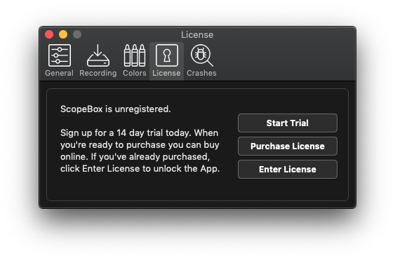

##Updating##
ScopeBox automatically checks for updates during startup. If you'd like to force it to check for an update, select "Check for Updates" from the ScopeBox menu.

You can disable automatic updates via the "General" tab of the preferences dialog.

> **ScopeBox can only check for updates if you are currently connected to the internet. If your ScopeBox system is not connected, you can always download an updated copy from <http://www.divergentmedia.com/scopebox>.**

#Application Overview#
The main ScopeBox window can be broken into 4 distinct regions. These are (a) the source bar at the top, (b) the palette region, (c) the recorder and cliplist, and (d) the sidebar.

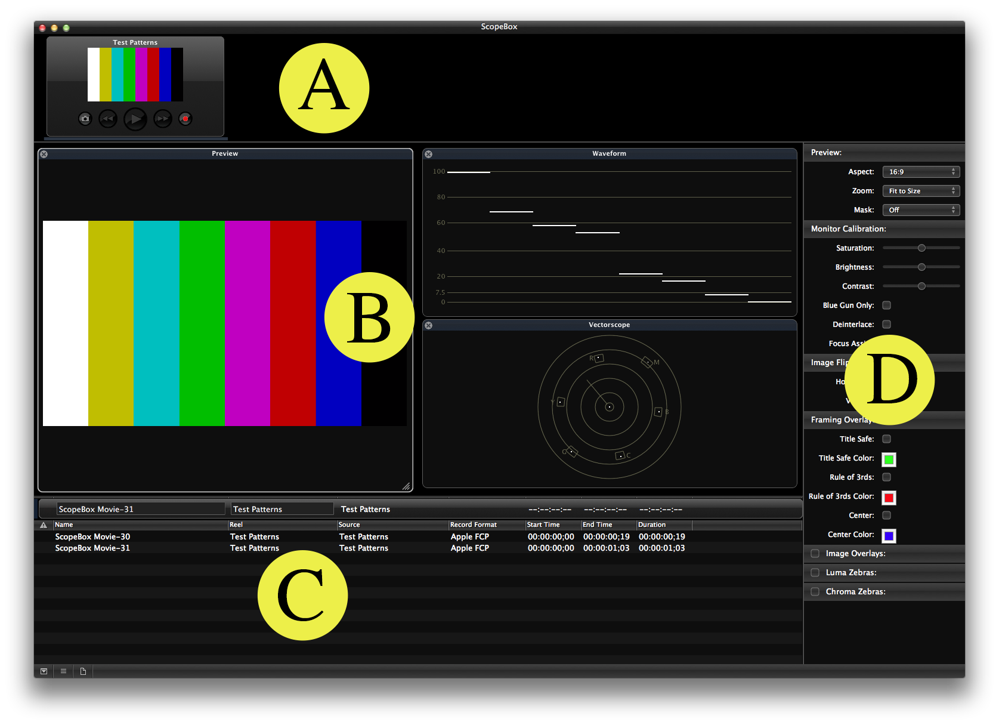

##The Source Bar##
Each source you add appears in the source bar as a small preview with built in VU meters, deck control buttons, still grabbing and recording buttons. This preview is called the Source Palette.

You can mix and match any combination of source types. The number of devices that may be used simultaneously is limited only by the processing power and bus bandwidth of your computer.

##The Palette Region##
Once you've added a source, you're free to start inspecting the signal in a variety of ways. You do this by adding palettes to the source. Each new palette you add will give you an additional tool to quantitatively or qualitatively examine the video, audio, or timecode signal of that source.

When a new palette is added, it appears in the Palette Region. This area serves as your general workspace for analyzing sources. You can add or remove palettes, change the source they monitor, or alter their size and position at any time.

##The Sidebar##
Changing the settings of one of your sources or palettes is done in the sidebar. Clicking on a palette, source, or recorder (which we'll get to in the next section) will select it. You can tell which item in the window is selected by the bright white border drawn around it. When an object is selected, a number of controls will appear in the sidebar. Changing these settings will alter the behavior of the selected object.

##The Recorder and Clip List##
If you're upgrading from ScopeBox 2.0, you may notice that the Recorder is no longer displayed when you add a new source. Instead, it is available when you reveal the Clip List. This gives you more space for your palettes, and access to all of your recordings is only one click away.

To reveal the Recorder and Clip List, click the icon in the lower left corner of the window. You'll see a bar for each source. This is your recorder settings bar. It works in tandem with the record button in the source palette to allow you to set up video and audio records, as well as get feedback for records currently happening. You'll see a separate color-coded recorder settings bar for each recordable source currently open.

The recorder settings bar has fields for the name of each file to be recorded, the reel info embedded in QuickTime movies, and the start time, end time and current duration of any recordings in progress. In addition, clicking on the bar reveals the in-depth settings for each recorder.

Beneath this is the [clip list](#the-clip-list). This list allows you to review at a glance all the day's prior recordings, and change names or reel info.  

You can toggle to a thumbnail view of your recordings using the second icon from the left, which looks like a series of horizontal lines.

#Dealing with Sources#

##Adding a Source##
The Source menu allows you to add new sources. In addition, new sources can be added by right clicking within the source bar and choosing the desired source under Add Source.

By default, you will be presented with the options "Add Live Source," "Add Movie Source," "Add ScopeLink Source," and "Add Test Patterns." You may see additional sources, depending on installed plug-ins. All standard FireWire cameras and QuickTime compatible capture cards will appear under the "Add Live Source" menu.

The "Movie Source" menu allows you to open any QuickTime-compatible video within ScopeBox.  ScopeLink is covered in a [separate chapter](#scopelink).

###Unavailable Sources###
If a source is unavailable, it will be grayed-out in the menu. A source may be unavailable for many reasons:

* It is already open in ScopeBox or another application.
* Your system is missing the necessary codecs or drivers.
* There is a conflict between devices on your FireWire bus.

If you are having problems with a device please refer to the source diagnostics and troubleshooting sections near the end of this manual.

##Removing a Source##
To remove a source, simply select the source's palette in the source bar, and choose "Remove Source" from the Source menu. You can also right click on a Source Palette and choose "Remove Source".

##The Source Palette##
Once you've added a source, its Source Palette will appear in the source bar at the top of the ScopeBox window. The source palette is a quick way to confirm you are receiving the proper video and audio signals. Below the video preview, you'll find a set of controls for either deck control or movie shuttling. If the source is recordable, buttons will be available for grabbing a still and starting and stopping records.

##Changing a Source's Settings##
If you click on the preview palette, the left side of the window will display all the appropriate options for that source. These will depend upon the type of source you have selected.

Settings are split into three sections: video, audio and timecode. Unchecking the checkbox next to any of these will disable that channel of the source.

###Video###
You may change the name of the source using the Device field - just click and begin typing. This can be useful when using more than one of the same device.

The "Input" dropdown allows you to select which input you would like assigned to this source. This dropdown will only show up for devices or capture cards with multiple inputs. However, many such devices choose to present themselves as discrete devices rather than a single source with different inputs. In those cases, the dropdown will be disabled, and you'll select the input as part of the device selection process.

The "Compressor" dropdown allows you to change the compression scheme used to display and record the source. ScopeBox will convert your video to the selected format in realtime. By default, this box will reflect the native format of your source. Keep in mind that compression can be very CPU-intensive.

> **This isn't the area to change your record format. See the [recording](#recording) chapters for details on transcoding during record.**

The "Preview Level" dropdown allows you to change the quality level ScopeBox uses to decompress your video before processing and displaying it. By default this will be set to High, and can be left alone unless your machine is unable to process your current source at full resolution without dropping frames.

The "Setup" dropdown allows you to change the setup level of your video. This is the baseline level for black in your video. You shouldn't change this setting unless your black levels appear to be incorrect in the waveform palette. Additionally, before altering this setting, be sure that your capture card drive is properly configured. This setting will not impact recordings.

If your device presents custom controls to QuickTime the advanced settings button allows you make adjustments to these.

HDV FireWire devices will have a checkbox to enable I-Frame only decompression. This only decompresses every twelfth to fifteenth frame, allowing HDV to be used with much older or slower machines that might not otherwise be able to process HDV video. Due to the nature of HDV video, I-Frame only decompression allows the frames that do arrive to be displayed with much lower latency as well.

DV and DVCProHD FireWire devices will have a "Remove Duplicate Frames" checkbox. If your camera supports pulled up progressive formats, this allows you to strip any duplicate frames from the signal, and record a progressive movie, without wasting the disk space on redundant frames.

Currently ScopeBox can properly process duplicate frames in: 

* DV24pA
* DVCproHD 720p24
* DVCproHD 720p30
* DVCProHD 1080 24pA

> **When using dupe removal with DVCProHD cameras such as Panasonic's HVX200, it is important to choose the correct format in the camera's menus. See the troubleshooting and source diagnostics sections near the end of this manual for more information.**

###Audio###
The audio section allows you to select an audio source for recording and adjust the level at which the audio is played through your computer speakers.

The preview audio adjustment is for monitoring only - any changes you need to make to adjust the levels you see within your VU meters should be done in your camera's audio controls.

###Timecode###

If your device is connected via FireWire and supports AVC protocols (DV, DVCProHD, or HDV devices) then timecode and deck control will automatically be activated and configured. If you are using any other device, you will see a popup to choose a serial port for connecting to decks or cameras via Sony rs232/rs422 protocol.

Because serial deck control does not provide information about the timecode format of the device, you'll also need to choose the appropriate timecode format to tag incoming timecode.

###Preview Adjustments (LUTs)###
It's often helpful to preview a signal with adjustments applied, to get a sense of how an image will look after color correction is applied or other changes are made. For example, when shooting in the log space, you may wish to preview the image in the linear space. The Preview Adjustments section of the source settings allow you to apply these adjustments via LUTs (look up tables)

ScopeBox supports two LUT formats, cube (1d and 3d) and 3dl. To apply a LUT, check the Preview Adjustments box and then click Set Path. This will allow you to load a LUT in one of the supported formats. You may easily toggle the LUT on and off by checking the Preview Adjustments box.

LUTs impact all of the palettes, including the preview and any scopes. LUTs **do not** impact recorded files. LUTs are automatically reloaded if they contents of the LUT file changes on disk.

> **We support a variety of LUT formats in ScopeBox, but many production pipelines use custom LUTs.  If you've got a LUT that isn't working with ScopeBox, send us a copy at <support@divergentmedia.com>, along with a brief description of what the LUT is intended to do.**

##Drop Frame Warnings##
Periodically, under high usage you may see a yellow caution icon appear next to the video preview in the source palette. This is ScopeBox's warning that the source has dropped one or more frames. You can reset this warning by right-clicking on the source palette and choosing "Reset Drop Frame Warnings."

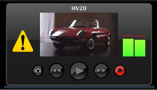

While a certain number of dropped frames are unavoidable under conditions of extreme system usage, it's also possible to see dropped frames when adding or removing sources. If the drop frame warnings are persistent, check the performance section near the end of this manual for tips on diagnosing the problem.

##Saving and Recalling Sources##
Once you've adjusted all of your source settings, you can save a preset. Highlight the source in the source bar, and then select "Save" from the Source menu. This will save all of the settings for the source, including recorder settings and alerts.

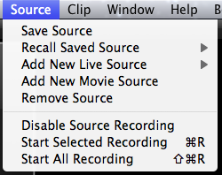

To recall a source, select it from the "Recall Saved Source" menu.

Sources will be saved with the device name set in the sidebar (see above).

You can set a default source, which will automatically be loaded (if available) when ScopeBox is launched, in the preferences.

#Palette Overview#
##Working with Palettes##
ScopeBox displays all content in flexible palettes within the palette region of the ScopeBox window. The settings for each palette are displayed in the sidebar on the right side of the ScopeBox window whenever a palette is selected.

You may add multiple copies of each palette, each with its own settings. For example, you may choose to open a preview palette for each of your sources, and you may choose to also multiple preview palettes for a single source, each with distinct settings.

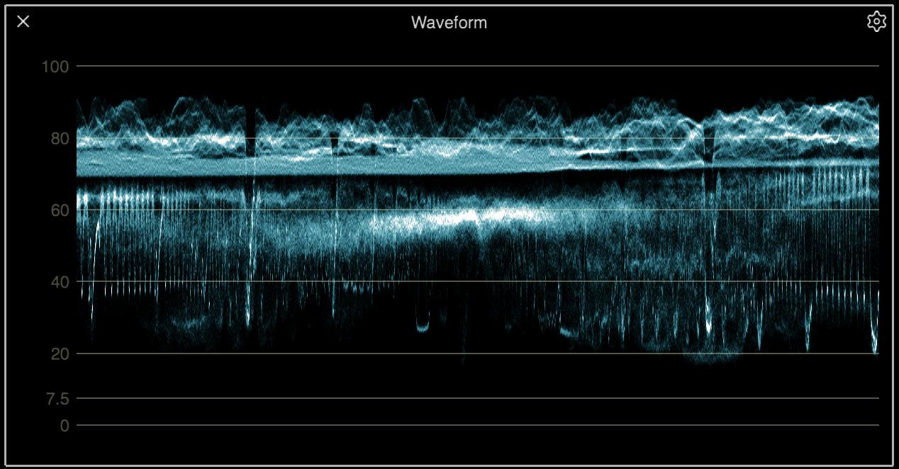

###Adding Palettes###
To add new palettes, select the desired palette type from the Palettes menu or right click on the background of the ScopeBox window or on the source palette.

###Closing Palettes###
To close a palette, click the "x" in the upper left corner or hit the delete key while the palette is selected. You may also right click palette and select "close."

###Moving Palettes###
Click and drag to move a palette to the desired position. You can also use the arrows keys for very precise positioning of a selected palette.

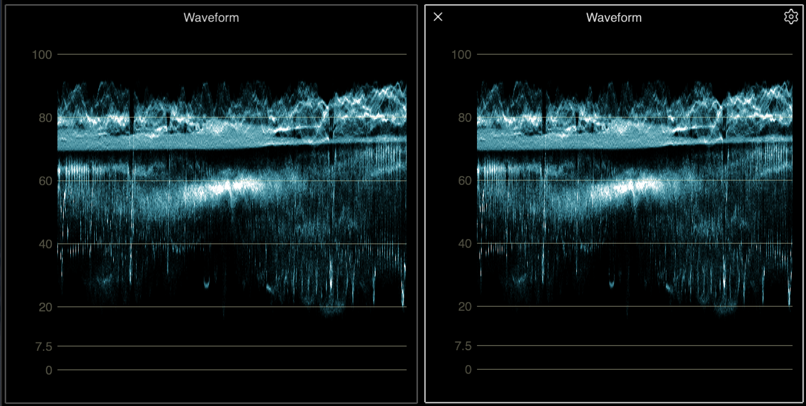

If you wish to organize your palettes with more precision, you can "Enable Snapping" in the Layouts menu. This will constrain your palette's movement and re-sizing to an internal grid, allowing you to easily line up multiple palettes.

###Resizing Palettes###
Click and drag on the lower right corner to resize a palette.

###Soloing Palettes###
Soloing a palette allows you to temporarily hide all other palettes and focus your attention on the selected palette re-sized full screen. You can activate a palette's soloing by choosing Solo Palette from the View menu, by right clicking on the palettes.

###Open in New Window###
While ScopeBox defaults to a "one-window" view, you can extract any palette into its own window. This makes it easy to use ScopeBox in a multi-monitor configuration. To open a palette in its own window, right click on the palette and select "Open in New Window." To view the settings for a windowed palette, right click on the palette and select "Show Palette Settings."

###Switching Sources###
When you have multiple source open, each palette contains a set of small circular buttons in the upper right corner. Each button corresponds to a source in your Source bar. To select which source the palette is monitoring, click the button corresponding to the desired source's color.

You can also change a palette's source by right clicking and choosing a new source from the Source sub-menu.

##Common Settings##

Some settings are shared among many palettes. They are detailed in this section.

###Sampling###
By default, ScopeBox scopes process video at full resolution, which may be too resource intensive for slower computers or high definition signals. Selecting a sub-sampling multiplier tells the scope to look at only every other line (2), every fourth line (4), or every eighth line (8) when computing the scope.

###Intensity###
When in weighted mode, the intensity slider adjusts the brightness of the scope. By changing this value, you adjust the visibility of areas of low pixel concentration.

###Colors###
The color of the graticules and traces can be set in the application preferences, available under the "ScopeBox" menu.

#Preview Palette#
The Preview palette displays video source output and can replace a traditional field monitor for checking focus, framing, and color calibration.

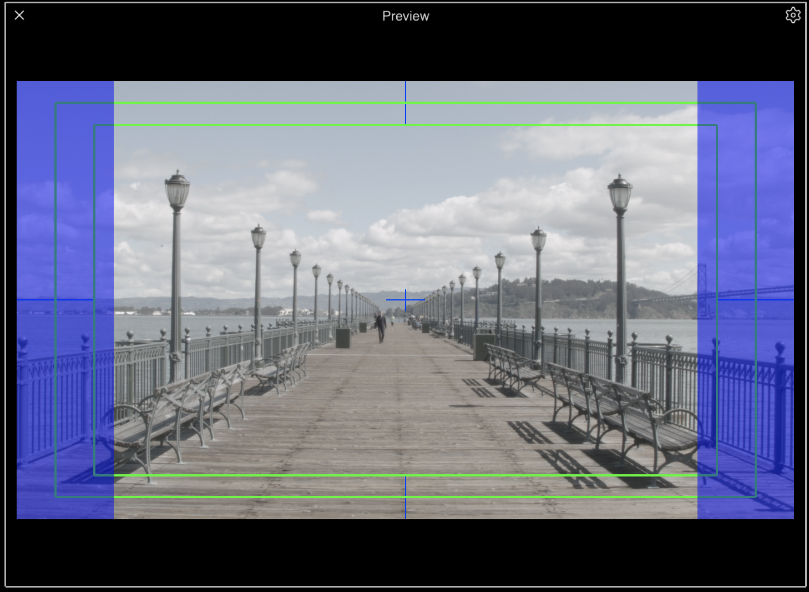

##Controls##
When you select the preview palette, the following controls will appear in the sidebar.

> **Changes made to the image in monitor calibration only affect what you see in the preview palette. They are not reflected in any other scopes, nor are they recorded to disk. Monitor Calibration should only be used to ensure your preview accurately reflects the video signal. You can do this by calibrating to color bars sent from your source device.**

###Aspect###
Controls the aspect ratio at which the video source will be displayed.

Standard Definition video uses rectangular pixels whereas computer monitors use square pixels. This can result in video images that are stretched when displayed on a computer. If you're shooting HD, the 16:9 option should be selected by default. For SD sources, you can either view the native "rectangular" pixels, or the corrected "square" display. When you choose a new source, ScopeBox will automatically set your preview's aspect to match that of the incoming image.

###Zoom###
Zoom sets the size of your image. 100% and 200% set the video image to the corresponding magnification no matter the size of the preview palette. This gives you a pixel-for-pixel view of your image with no interpolation from the graphics card or video re-size, which is especially useful when trying to set focus. However, if your palette is too small you may not see the whole image. "Fit to Size" fits the video to fill the palette, but does so by re-sizing the image which may introduce minor sub-sampling interpolation - leading to a slightly blurrier image.

###Mask###
The mask overlay draws blue bars as a framing guide when shooting at an aspect ratio other than the destination ratio. Using this will allow you to frame shots not only for the acquisition format, but for any other formats you may have to deliver to as well. For instance, if you know the video you are shooting in HD (16x9) will be used in an SD production, setting your mask to 4x3 will allow to see where by default the image will be cropped in the format change.

###Monitor Calibration###
The Saturation, Brightness, and Contrast sliders provide simple correction of the Preview image. These corrections are used to compensate for differences in computer monitors. Calibrating the Preview palette ensures that the image accurately represents what the camera is shooting. Any changes made do not affect the video captured to disk or the video monitored in any other scope.

###Blue Gun###
When checked, the Preview palette displays the blue channel as black and white, ignoring red and green. This simulates the "blue only" button on many CRT monitors, which is useful when calibrating a monitor with SMPTE color bars.

###Flip###
Flips the preview image horizontal and/or vertically. This function can be used to correct for a lens adapter or 3d rig that flips the image.

###Deinterlace###
Deinterlace blends the two frames of an interlaced source together. This will remove the "comb" effect which can appear when viewing interlaced video on a progressive monitor.

###Focus Assist###
Focus Assist is similar to the "peaking" feature found on some camcorders. This will add highlights to your video at sharp edges. This can be helpful when adjusting focus.

###Title Safe###
Title Safe adds two overlay boxes to the video. The outer box shows the graphics safe region and the inner box shows the title safe region. Make sure important action happens inside the title safe box, as older televisions may crop beyond it.

###Rule of Thirds###
Provides a 3x3 grid to assist with composition.

###Center###
Provides center cross-hairs to assist with composition.

###Luma Zebra###
Luma Zebra overlays rolling stripes on the brightest areas of the image. These areas may be overexposed. The slider controls the threshold at which the zebras appear. The stripe color is displayed in the square to the right and can be clicked to select another color.

###Chroma Zebra###
Chroma Zebra is similar to the Luma Zebras but overlays a zebra pattern on the areas of highest saturation.

###Overlay###
Overlays allow you to open an image or QuickTime movie to superimpose on top of you live video. These images can be custom guides for framing around your productions lower thirds, a background that will later be chroma keyed into the shot, or video footage you need to match framing or exposure in.

To add an image, make sure the dropdown is set to "Custom Image", and drag and drop an image into the image well below. In addition, any other open movie or live source can be selected from the dropdown to use it as the superimposed item. Below the image well is a slider to adjust the opacity of the overlay.

#Audio Meters#
The Audio Meter displays the level of the audio signal in dBFS. It provides both an instant meter and an averaging peak meter. Every spike is displayed, even if very brief.

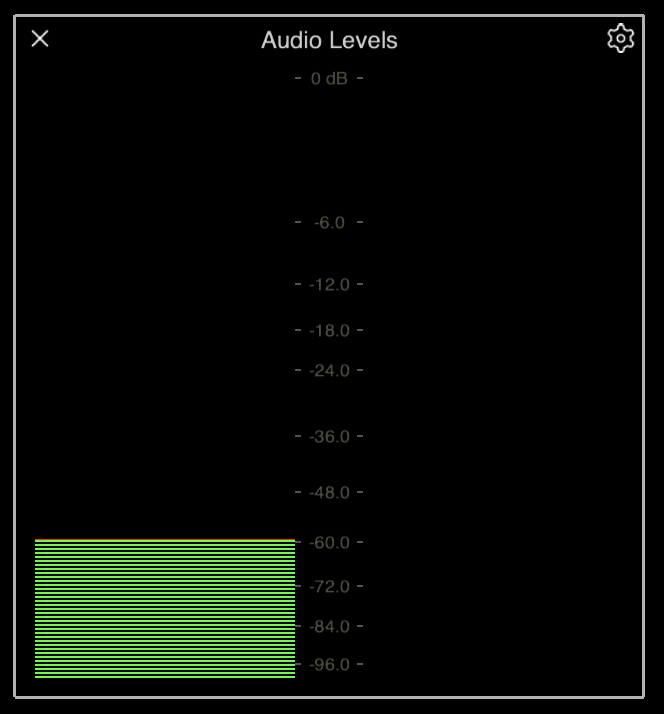

##Controls##

###Channel Count###
By default the Audio Meter will show all channels currently reported by a source. However, many devices report a fixed number of output channels, which can waste valuable screen space displaying empty channels. If you're shooting with a camera that sends eight channels to ScopeBox, but are only using two, you can set channel count to 2 to only present the first two channels.

###Scale###
Different source formats require different peak audio levels. This level is often referred to as Unity. When working with bars and tone, or when trying to set your mic volumes at the proper levels, you want to know exactly where unity lies in the Audio Meter. ScopeBox provides a set of Scale markers for each of the three major unity levels found on professional video devices -12, -14 and -20 dB.

#Surround Meters#

The Surround Meters give you a way to visualize your audio signal in a surround sound context. This allows you to quickly analyze the surround components of your audio mix, even in environments that don't lend themselves to proper audio monitoring.

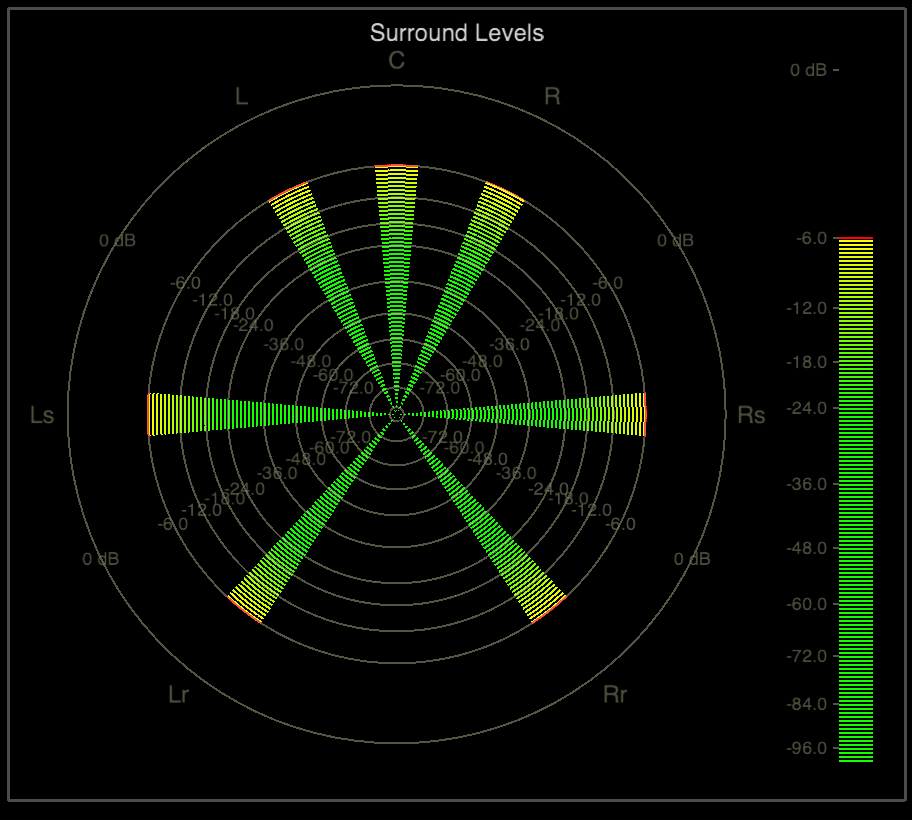

Because audio inputs do not inherently pass information about how to lay out each channel in a surround environment, ScopeBox provides a variety of popular channel layouts. Select the layout which matches the input layout you are feeding ScopeBox.

The palette settings also allow you to set the scale, and enable a "peak hold" option, similar to the Audio Meters (see [section 7](#Audio-Meters)).

#Waveform#

The Waveform scope provides a view of the luminance in the video signal. The vertical axis corresponds to luminance while the horizontal axis matches the horizontal axis of the video source.

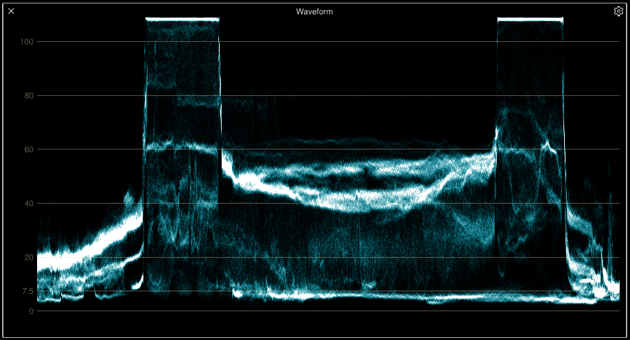

##Controls##
###Mode###
The Mode dropdown allows you to choose the method ScopeBox uses to render your scope. Each mode offers you different information:

*Weighted* mode looks more like a traditional raster scope and expresses the number of pixels at a given value by varying the brightness.

*Mono* displays every data point at full intensity, which can be useful in ensuring complete legality. With weighted views it is possible to miss a small pixel region that is out of range.

*Colorize* replaces the traditional green in a scope and with the actual color that it represents. For example, if someone is wearing a bright red shirt, there will be a bright red streak where the scope renders those pixels.

###Filter###
The Filter dropdown allows you to select between the three commonly found filter types found on hardware waveform monitors - *Luma*, *Chroma* and *Flat*. Luma is the default, causing the waveform to display only the luminance (Y) channel of your video. Chroma will display only the chrominance (C) channel of your video. Flat combines the two channels, and gives you a view of the total overall levels within your video. Flat and Chroma will always use NTSC I/Q scaling.

###Instantaneous Envelopes###
Instantaneous Envelopes help ensure that you don't miss any data within your waveform monitor, even when it's just a single pixel. Checking the box will cause two bounding lines to be added to your waveform, one showing the maximum values for your waveform, and one showing the minimum values for each vertical line.

###Peak Envelopes###
Peak envelopes show the maximum and minimum values for your waveform over time. This allows you to look away from your scopes, and still know whether you exceeded a target threshold. The reset button will clear the peak values.

###Scale###
There are four different Scale options available for measuring your waveform. These are IRE (the traditional scale for a waveform monitor), 8 bit, 10 bit and mV (millivolt). The 8 bit and 10 bit options allow you to measure your waveform according to the actual sample values in the signal. Millivolt allows you to compare against the signal shown by a traditional hardware waveform monitor or oscilloscope.

#Vectorscope#

The Vectorscope displays chrominance (color) information. Saturation is indicated by distance from the center while the position around the circle indicates hue.

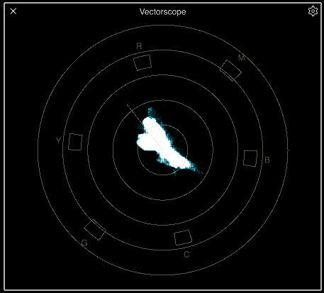

The markers on the Vectorscope (R, Y, B, etc) indicate colors. The boxes show where the signal should land when displaying the standard SMPTE color bars signal, providing a guide for evaluating saturation. The targets are plus and minus 5 degrees and 5% saturation.

The rings represent saturation percentage, in 20% increments (the innermost circle represents 20% saturation, the next 40%, etc).

##Controls##

###Colorspace###
The colorspace option provides three different colorspaces with which to view the vectorscope. These are NTSC, Rec. 601 and Rec. 709. By default, ScopeBox will automatically set the colorspace based on your source. These colorspaces will adjust the color targets and scaling of the vectorscope.

###Mode###
The Mode dropdown allows you to choose the method ScopeBox uses to render your scope. Each mode offers you different information:

*Weighted* mode looks like a traditional scope and expresses the number of pixels at a given value by varying the brightness.
*Mono* mode displays every data point at full intensity, which can be useful in ensuring complete legality. With weighted views it is possible to miss a small pixel region that is out of range.
*Colorize* mode replaces the traditional green in a scope and with the actual color that it represents. For example, if someone is wearing a bright red shirt, there will be a bright red streak where the scope renders those pixels.

###Instantaneous Envelopes###
Instantaneous Envelopes help ensure that you don't miss any data within your vectorscope, even when it's just a single pixel. Checking the box will cause draw a boundary around the maximum values of your vectorscope.

###Peak Envelopes###
Peak envelopes show the maximum and minimum values for your vectorscope over time. This allows you to look away from your scopes, and still know whether you exceeded a target threshold. The reset button will clear the peak values.

###Hue Line###
The Hue Line can be thought of as a configurable target line. After enabling this option, you can click and drag the hue line to place it at any point on the vectorscope. You can also use the "hue" and "power" sliders to alter the line. This gives you a convenient reference mark for color correction or matching shots.

###Flesh Line###
The Flesh Line is an industry standard reference line along which skin tones will generally fall. It's most useful as a static reference between scenes or cameras.

###Grat Style###
The default graticule style for the vectorscope a standard set of concentric circles, representing saturation.
ScopeBox also offers a "hue vectors" graticule style, which provides
a more modern, color correct and camera matching specific overlay. This view gives more contextual information for hue adjustments across the entire range of saturations, while removing unneeded clutter more appropriate for signal-analysis and legality monitoring. The perpendicular hash marks on each line represent a 75% target

> **Hue vectors graticule by [Alexis Van Hurkman](http://vanhurkman.com/wordpress/?p=2563) is licensed under a [Creative Commons Attribution-ShareAlike 3.0 Unported License](http://creativecommons.org/licenses/by-sa/3.0/deed.en_US)**

#HML Balance#

The HML Balance palette can be thought of as three distinct vectorscopes, displaying information about the "high," "mid," and "low" components of your signal. This can be helpful for identifying color casts in specific luminance regions of your image, like shadows or highlights.

Because the crosspoints between the three vectorscopes are configurable, this palette can be filtered in a variety of ways to allow you to focus on just one component of your signal.

Many of the controls are similar to those found on the vectorscope, but there are some HML-specific controls as well.

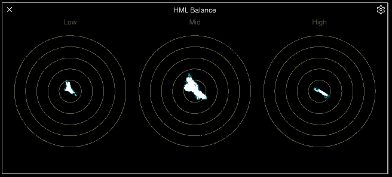

##Controls##
###Zoom###
The Zoom control is a variable zoom, allowing you scale up the scopes to see even the most minute detail. Keep in mind that with an 8-bit signal, the amount of resolution available in the display is inherently very limited.

###Luma Threshold###
The "low" and "high" values act as low- and high-pass filters, respectively. Everything below the value entered in the "low" field will be displayed on the low scope, everything above the value entered in the "high" field will be displayed in the high scope, and everything in between will be drawn in the mid scope.

#RGB Parade#
The RGB Parade displays individual waveforms for each channel (Red, Green and Blue) of your video signal.

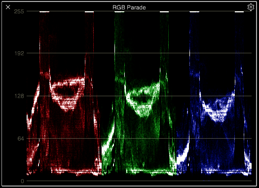

You can use the RGB Parade to gauge separation between the color channels. For example, when setting white balance, all three channels should be equal horizontally, indicating that you have equal amounts of red, green and blue, thus creating white.

The RGB Parade is also useful when trying to determine the cause of a color cast in shadow or highlight areas. Such casts can be caused by clipping (overexposure or underexposure) in one particular color channel. It is often difficult to diagnose this issue without a specialized tool like the RGB Parade.

##Controls##
###Layout###
The layout control allows you to display your RGB parade as either "R,G,B," "B,G,R," or "Overlay." Overlay mode will stack each channel, and composite their values.

###Mode###
The Mode dropdown allows you to choose the method ScopeBox uses to render your scope. Each mode offers you different information:

*Weighted* mode looks like a traditional scope and expresses the number of pixels at a given value by varying the brightness.

*Mono* mode displays every data point at full intensity, which can be useful in ensuring complete legality. With weighted views it is possible to miss a small pixel region that is out of range.

###Instantaneous Envelopes###
Instantaneous Envelopes help ensure that you don't miss any data within your monitor, even when it's just a single pixel. Checking the box will cause two bounding lines to be added to your waveform, one showing the maximum values for your waveform, and one showing the minimum values for each vertical line.

###Peak Envelopes###
Peak envelopes show the maximum and minimum values for each channel over time. This allows you to look away from your scopes, and still know whether you exceeded a target threshold. The reset button will clear the peak values.

###Transform###
The transform allows you to control how a YUV source is converted to RGB for monitoring.

#YUV Parade#

The YUV Parade displays individual waveform monitors for the Y, U and V components of the signal.

The YUV Parade is useful for signal chain diagnosis since most video devices process in the YUV colorspace.

##Controls##

###Mode###
The Mode dropdown allows you to choose the method ScopeBox uses to render your scope. Each mode offers you different information.

*Weighted* mode looks like a traditional scope and expresses the number of pixels at a given value by varying the brightness.

*Mono* mode displays every data point at full intensity, which can be useful in ensuring complete legality. With weighted views it is possible to miss a small pixel region that is out of range.

###Instantaneous Envelopes###
Instantaneous Envelopes help ensure that you don't miss any data within your monitor, even when it's just a single pixel. Checking the box will cause two bounding lines to be added to your waveform, one showing the maximum values for your waveform, and one showing the minimum values for each vertical line.

###Peak Envelopes###
Peak envelopes show the maximum and minimum values for each component over time. This allows you to look away from your scopes, and still know whether you exceeded a target threshold. The reset button will clear the peak values.

#Luma Histogram#
The Luma Histogram displays the range of luminance levels in
the video signal, with black on the left and white on the right. The height of each line corresponds to the percentage of the image that occurs at that luminance level.

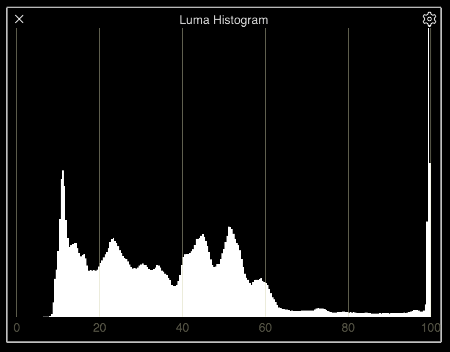

##Controls##
###Scaling###
The Luma Histogram can be toggled between "log" and "linear" scaling. In log mode, each horizontal graticule represents an order of magnitude - 10, 100, 1000 and so on. This means that even luminance levels with relatively low frequency within your signal will be easily visible within the palette.

Linear scaling causes the vertical axis to be scaled to the height of the most populated luminance level.

#RGB Histogram#
The RGB Histogram displays the intensity of the Red, Green and Blue signals. Similar to the Luma Histogram, the leftmost column is the lowest intensity and the rightmost is the highest intensity.

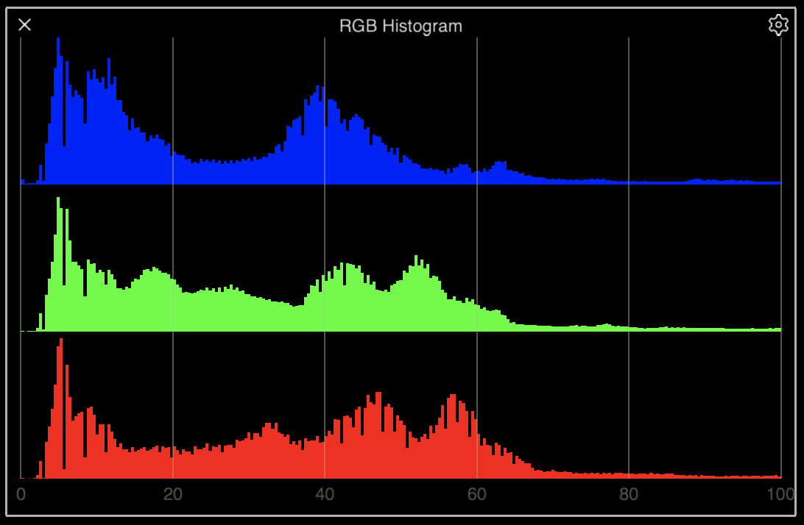

The RGB histogram is particularly useful when working with chroma key shots. The key color should be as even as possible for clean keying. Doing so produces a very tight clump of long bars rather than a wider clump of short bars.

##Controls##
###RGB Transform###

The RGB Histogram provides a simple way to watch for gamut excursions. The RGB Transform dropdown allows you to select from among three transforms. This will draw vertical bars on the RGB histogram. Values falling outsides these bars indicate a gamut excursion.

###Scaling###
The RGB Histogram can be toggled between "log" and "linear" scaling. In log mode, each horizontal graticule represents an order of magnitude - 10, 100, 1000 and so on. This means that even levels with relatively low frequency within your signal will be easily visible within the palette.

Linear scaling causes the vertical axis to be scaled to the height of the most populated intensity for a given channel.

#Timecode#
The Timecode palette displays the timecode as sent from the video source, generally when playing a tape or recording. Some devices operate in "free run" mode, which generates timecode without a tape present. Timecode is formatted in SMPTE standard format - Drop Frame timecodes have a semicolon (;) between the seconds and frames place whereas Non Drop Frame timecodes have a colon (:).

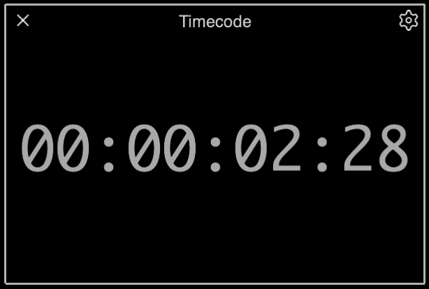

#Channel Plot#

The channel plot allows you to map two channels of a video signal on an X/Y axis. The box drawn within the scope helps you determine when your signal will be clipped by a colorspace conversion (gammut errors).

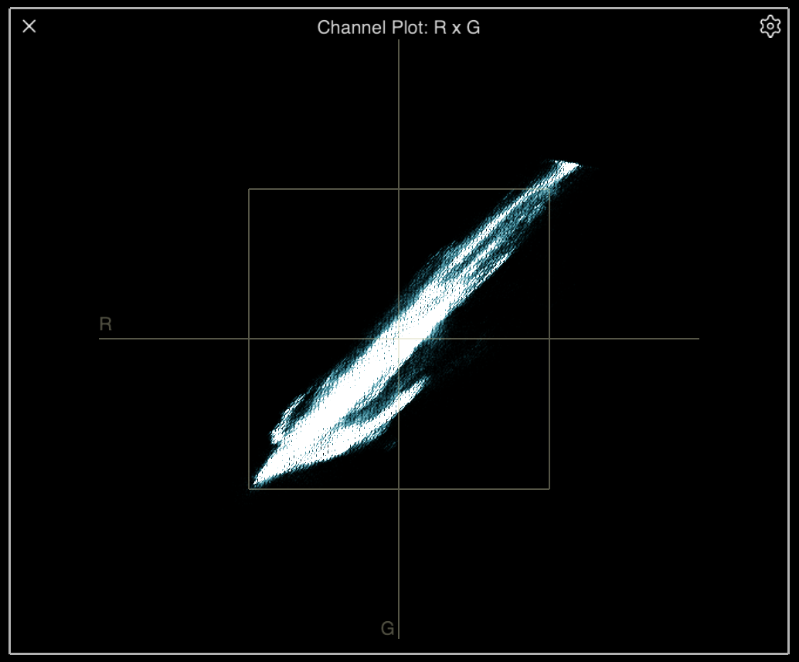

##Controls##
###Axis Controls###

There are six different channels which may be plotted on either the X or Y axis. These are Y, Cb, Cr and R,G,B. The channel plot is primarily useful when plotting values within a single color format. For example, you'd generally want to plot R against G or B, rather than against Y,Cb,Cr. By plotting R versus G, and in a second palette,
G versus B, you'll be able to quickly judge whether any data will be clipped during the YUV to RGB conversion.

#Quartz Composer#

Quartz Composer is an Apple technology for visually building graphical compositions. ScopeBox allows you to use Quartz Composer projects as plugins, to alter the display your video signal in realtime.

To load a Quartz Composer project, click the "set path" button and browse to the QTZ file you wish to use. Quartz Composer projects dictate which controls will be shown within the ScopeBox window.

If you save Quartz Composer projects (QTZ) in ScopeBox Application Support folder (inside your Library folder) they'll appear as palettes you can add to ScopeBox directly.

For details on creating ScopeBox-compatible Quartz Composer files, see the separate ScopeBox 3 SDK documentation.

#Recording#

##Starting and Stopping a Record##
Each source has a record button, which can be used to stop and start recording. By default, ScopeBox will store files in the location specified in your preferences. From the Source menu, you can also start recording one or all of your sources simultaneously.

##Recorder Settings Bars##
The name of the video file and the reel name are set for each recording source in the source Recorder Settings Bar, which is revealed by clicking the icon in the lower left corner of the ScopeBox window.

By clicking a source's Recorder Settings Bar, you can access additional options in the sidebar.

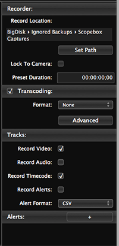

###Record Path###
ScopeBox has a global record path setting (in the preferences window). In addition, you may set a record location on a per-recording basis using the "Set Path" button.

Because multicam shoots can be disk-bandwidth intensive, spreading your recordings across multiple drives may enhance performance.

###Lock to Camera###
When Lock to Camera is enabled, ScopeBox will monitor your attached source's tape status. If the device goes into record mode, ScopeBox will also begin to record. When the device returns to Stop or Pause state, ScopeBox will stop the record.  **Lock to Camera is not available with devices connected via HDMI or HD-SDI.**

This allows you to easily record both on your camera and within ScopeBox with one push of a button on your camera.

It's important to realize, however, that when Lock to Camera is enabled, the record button on your Source Palette will no longer work. Lock to Camera also means that ScopeBox will discontinue recording in the event you run out of tape on your camera.

>**Some cameras may not properly work with ScopeBox's Lock to Camera feature. Specifically, many HDV cameras reset the timing information in their video stream at the start of each recording. This may cause ScopeBox to record audio and video out of sync for the remainder of that shot.**

###Preset Duration###
If you'd like to utilize the LiveEdit functionality of ScopeBox, you'll need to enter a preset duration for your recording. Make sure this matches the length of the recording you intend to capture. By doing this, you'll be able to import your recording into your editing software and begin editing, while the capture is still in process. For maximum compatibility, we would recommend keeping this value under four hours. If you exceed this duration while editing, your record will continue, but you'll need to manually reload your video in your editor to load new content.

###Transcoding###
Transcoding allows you to convert your input source into another format in realtime, during capture. If you're working with an uncompressed source, this can be particularly helpful, allowing you to capture into a modern, visually lossless format like ProRes or DNxHD. The format dropdown provides a variety of presets for use with the major non-linear editing platforms. Selections will be grayed out if the corresponding codec is not available on your computer.

The advanced button allows you to create a custom transcoding setting.

Keep in mind that transcoding can be highly CPU intensive, particularly with custom settings.. If you notice dropped frames or unacceptable performance, you may wish to avoid using the transcoding functionality.

###Record Track Selections###
Sometimes you only need to record audio or video. In this case, uncheck any tracks you don't need, and ScopeBox will omit them from any future recordings - saving you disk space and CPU usage.

###Alerts###
Alerts allow you to set threshold values for your source, so that you can know when an exception has occurred, even if you're not watching your screen at that exact moment. Alerts are explained [in the next chapter](#alerts-1).

##The Clip List##
The triangle in the bottom left of the window will open the Clip List which shows you the history of all of your recordings. From the Clip List, you can review previous shots, change their file names or reel info, or check timecode information.

By right clicking on a clip in the Clip List, you can choose to open a movie in QuickTime Player, to show the file in the finder, or to open the clip as a new source in ScopeBox.

###Restore Previous Clips###
Within the "Recording" tab of the ScopeBox preferences, you'll find the "Restore Previous Clips on Launch" checkbox.  When checked, ScopeBox will maintain your clip list, even when quitting and restarting the application.  This can be helpful when working on a multi day shoot.  To clear the list, click the "reset" button within preferences.  You may also remove individual clips from the clip list by right clicking on them and selecting "remove."  This does not delete the recorded file, it merely removes the clip from the clip list.

###Thumbnail Mode###
The button to the right of the show/hide Clip List button allows you to toggle the Clip List between list mode and thumbnail mode. In thumbnail mode you can easily see the first frame of each clip.

##Drop Frame Warnings##
If while you are recording, the source detects a dropped frame, a warning will appear in both the Source palette and the associated Recorder Settings Bar to alert you to the dropped frame in your recorded clip.

The first column of the Clip List shows warnings for any previous clip which experienced dropped frames or custom alerts, allowing you to quickly review what may need to be reshot.

##FailSafe Recording##
ScopeBox 3 always writes coherent QuickTime files to disk. This means that even if you experience some sort of interruption mid-recording (a power outage, hardware or software failure, etc) the recording up to that point will be playable. This feature is always active.

#Alerts#

Alerts provide a way to monitor your signal, even when you don't have your eyes glued to the screen. Alerts are tied to recorders, and are enabled on a source by source basis.

##Activating Alerts##
Alerts can be attached to any recorder. After revealing the cliplist, click the recorder bar and check the box in the "Record Alerts" section of the bar on the right.

You may also select a format for alert recording. In addition to displaying in the cliplist, alerts will be saved to a file alongside your recorded output. See the "Export Formats" section below for details.

##Adding Alerts##
Initially, there are no alerts attached to your source. To attach alerts, check the "Record Alerts" box and then click the "add alert" button and select an alert type.

##Alert Types##
Alerts generally consist of a threshold value and a label. The threshold is the level at which the alert will be trigger. Labels allow you to add multiple copies of the same basic alert to your source, and is the name that will appear in your log. For example, you may wish to be alerted when your trigger exceeds 70 IRE and when it exceeds 90 IRE.

###Chroma Excursion###
This alert will fire when the chrominance level of your signal exceeds the selected value.

###Video Slug###
A video slug alert will trigger if no part of your signal is above the threshold you set. This can be useful for detecting signal dropouts.

###Audio Peak###
An audio peak alert fires for audio levels over a certain threshold. By setting this to "0 db," you'll be alerted any time you have clipped audio. By selecting a lower value, you may be able to act to prevent clipping by adjusting your audio levels.

###Gamut Excursion###
A gamut excursion will be fired any time a color will be lost or clipped in the YUV to RGB conversion. This alert is not configurable.

###Luma Excursion###
Luma Excursions can be attached to both maximum and minimum values. This allows you to be alerted of a signal above or below a set value. If you only wish to be alerted of upper-bound excursions, set the "minimum" value to -1.

##Viewing Alerts##
Alerts are displayed directly within the cliplist window, and are written to a file in the same folder as your recorded output. If your source has a free running timecode source attached, alerts will be tied to that time source. Alternatively, alerts will be tied to record run time.

Alerts have both a begin and end time.

##Exporting Alerts##
When alerts are associated with a recorded clip, they can be exported in a variety of formats. You may either export alerts for a single clip, or for all of the recordings you've done up to that point.

The export controls can be accessed from the "clip" menu. To export alerts for a single clip, highlight a recording in the cliplist and then select "Export Selected" from the clip menu. Alternatively, you may click the notepad icon at the bottom of the ScopeBox window.

##Export Formats##

There are three export formats available, depending on your workflow.

###HTML###
The HTML export format will generate an HTML file, with associated javascript and CSS. This page is designed to be opened in the Safari browser. In addition to a preview of the clip, you will be presented with a list of alerts. Clicking each alert will seek to the point within the video where the alert was triggered.

Keep in mind that the video playback capabilities of the web browser does not allow frame-accurate seeking. When necessary, ScopeBox will err on the side of seeking just before the alert time, rather than just after.

###CSV###
The CSV export format will generate a Microsoft Excel compatible CSV spreadsheet, with an entry for each alert.

###FCP and FCPX XML###
There are two XML options, for both Final Cut Pro 5 and later, and for Final Cut Pro X. When opened in Final Cut Pro, this XML will attempt to load the recorded files associated with each alert. Final Cut Pro will place markers within the video for each alert. This can be used to quickly find and correct issues within your source recording.

#ScopeLink#
ScopeLink allows you to monitor the signal from other applications on your computer, without any special hardware. Once installed, ScopeLink appears as an output option within supported applications, just like a traditional hardware output device. **ScopeLink requires Mac OS X 10.8 ("Mountain Lion") or later.**

Within ScopeBox, you can add the ScopeLink device from the source menu, just like any other source.  Select the application you'll be using with ScopeLink.

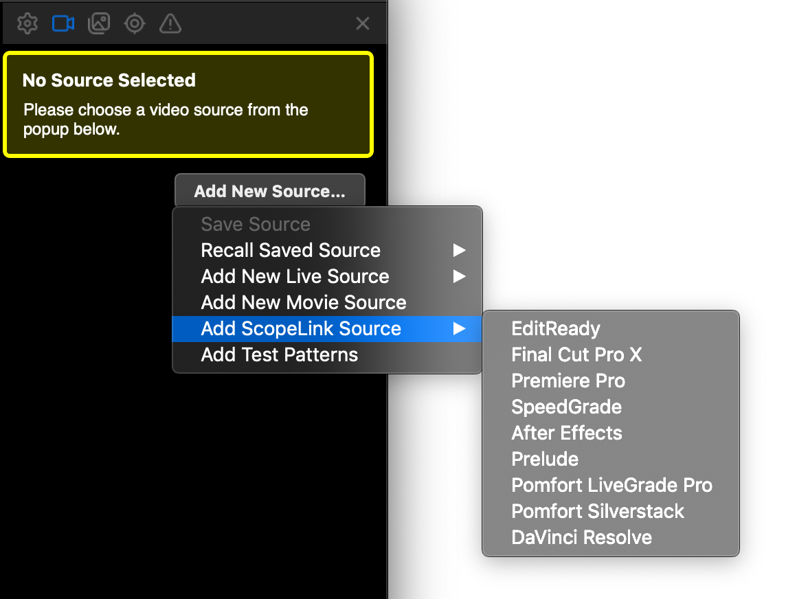

##Installing ScopeLink##

Installing ScopeLink requires administrator privileges on your computer. The first time you attempt to add a ScopeLink source, you'll be prompted to install ScopeLink. You can manually initiate the installation by selecting "Install Additional Software" from the ScopeBox menu.

The installation will prompt for your administrator password and install the ScopeLink software on your system.

##Configuring ScopeLink##
After installing, ScopeLink must be activated within the individual applications you wish to use with ScopeBox. This should only need to be done once per application.

###Adobe Premiere and Prelude###
To configure ScopeLink with Adobe Premiere Pro, or Adobe Prelude, begin by launching the application you wish to configure. Start a new project (the format doesn't matter). From the menu bar, select "Adobe Premiere" (or "Adobe Prelude" and then "Preferences." Within the preferences dialog, select the "Playback" option.

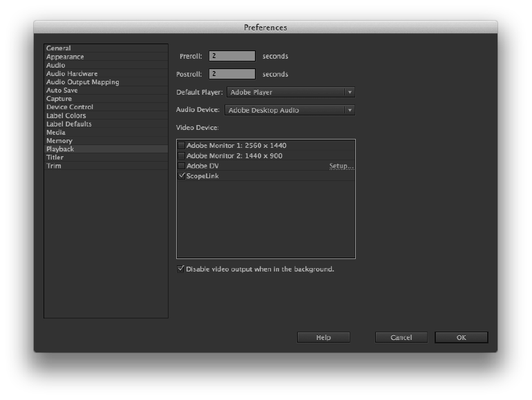

Check the box next to the ScopeLink device. You may also activate other devices if you wish. Click "OK," and then restart the application.

When used with Adobe Premiere Pro or Adobe Prelude, ScopeLink will transmit 8bit Rec. 709 signals, and ScopeBox will default to viewing within the Rec. 709 colorspace.

###Adobe After Effects 2014###
To use ScopeLink with Adobe After Effects 2014, begin by launching After Effects. Select "Preferences" from the "After Effects" menu, and then "View Preview." Enable Mercury Transmit, then set ScopeLink as the Video Device. We recommend unchecking "disable video output when in background".

Click "OK" and then relaunch After Effects.

When used with After Effects, ScopeLink will use the CCIR 601 colorspace for standard definition frame sizes, and Rec. 709 for high definition frame sizes.

###Adobe After Effects (Legacy)###
To use ScopeLink with pre-2014 versions of Adobe After Effects , begin by launching After Effects. Select "Preferences" from the "After Effects" menu, and then "View Preview." Set ScopeLink as the Output Device and Output Mode. We recommend checking all of the boxes in the "output during" section.

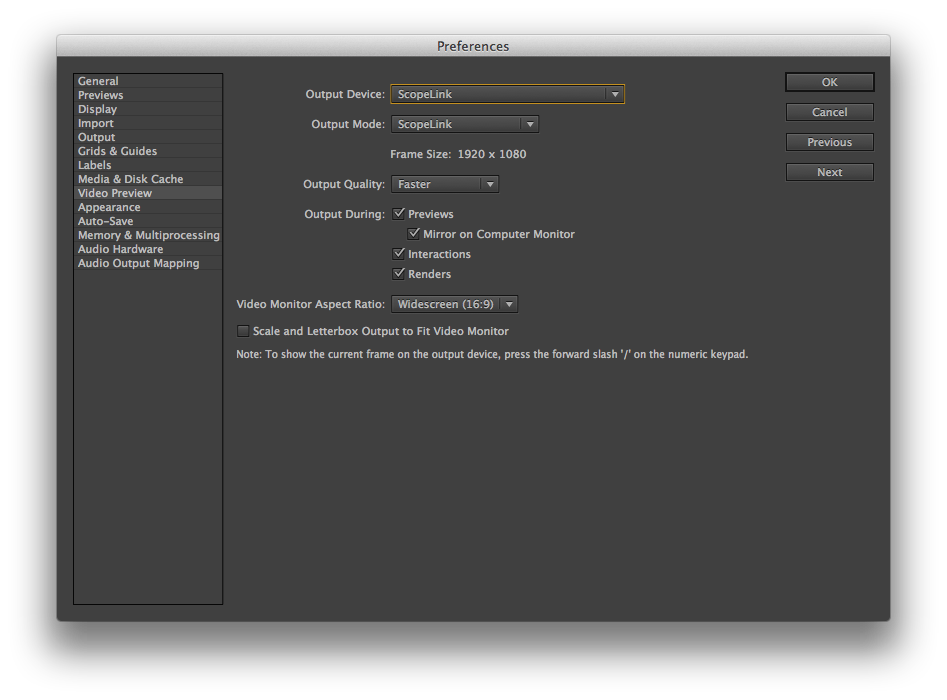

Click "OK" and then relaunch After Effects.

When used with After Effects, ScopeLink will use the CCIR 601 colorspace for standard definition frame sizes, and Rec. 709 for high definition frame sizes.

###Final Cut Pro X###
Launch Final Cut Pro X and open the Preferences.  Select ScopeLink in the "A/V Output" dropdown.

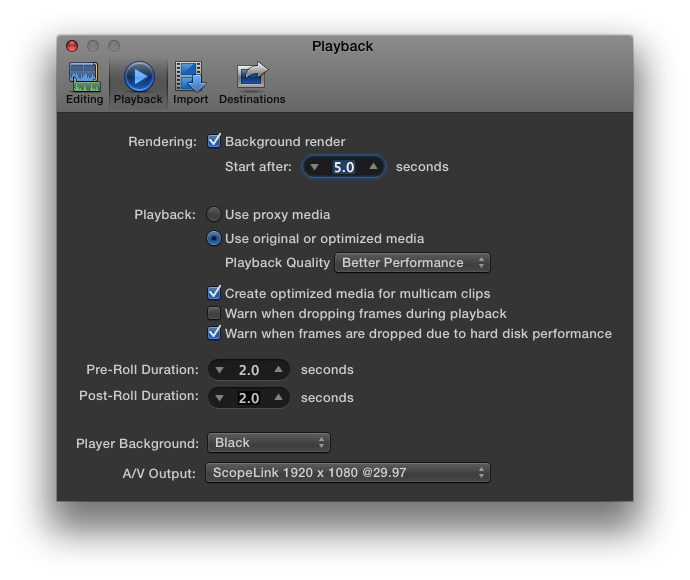

Close the preferences and select the "Window" menu from the top of the screen.  Click "A/V Output" to enable live output of your sequence.

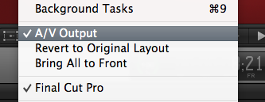

Restart Final Cut Pro X to begin using ScopeLink.

###Other Applications###
Other applications which support either QuickTime-based output or Adobe Transmit-based output may work with ScopeLink. Contact support if you'd like information on using a specific application with ScopeLink.

##ScopeLink Settings##
Depending on the application hosting ScopeLink, there are a variety of settings you may adjust.  After adding a ScopeLink source, click on the source palette to highlight it.  In some applications, you'll be able to set frame size, colorspace and frame format.  

These changes alter the type of frame being sent by the host application.  After changing these settings, you'll need to restart the host application.

Depending on your host application, selecting a non-native format (for example, requesting RGB frames from a YCbCr sequence) may increase system overhead.

#View Menu#
The View menu allows you to customize the look and feel of the main ScopeBox window. Each of the major sections of the window - the source bar, sidebar, and the clip list - can be shown or hidden from the View menu. In addition, you can save and recall preset palette layouts and configurations.

##Saving a new layout##
To save a custom layout, arrange the palettes as desired and select "Save Custom Layout...". You will be prompted to name your layout.

After clicking OK, you will find your newly saved layout in the Layouts menu.

##Restoring a layout##

Choose any of the layouts found in the custom layout section to restore the main window to this configuration.
You can set a default layout, which will be loaded every time ScopeBox is launched, via the preferences. If you ever wish to override this default, simply hold the shift key while launching ScopeBox.

#Window Menu#
The Window menu provides the Toggle Fullscreen option. Fullscreen mode hides the dock, menu bar, and all other applications, making ScopeBox the only visible application.

When in fullscreen mode, the menu bar is revealed when the cursor is at the top of the screen.

#Source Diagnostics#

If you're having trouble accessing a particular video device in ScopeBox, select "Source Diagnostics" from the Help menu.

The source diagnostics window will show all of the detected video devices on your system. If a device has a caution icon next to it, that means ScopeBox is unable to connect to that device. By selecting the problem device in the list, you'll see an explanation below of what reason ScopeBox has for disabling this source.

There are a few common problems which may cause devices to be disabled, depending upon their type.

##Capture cards and IIDC or USB cameras##
These traditional QuickTime supported devices are disabled most often due to a conflict with another piece of software on your computer. These devices can only be used by a single application at once.

Applications like FCP must be explicitly told not to open their device, or launched after ScopeBox has opened the device as a source. Also, many instant messaging clients will take control of a camera when launched, even if you're not actively engaged in a video chat.

##HDV, or DVCProHD cameras##
In order to take advantage of some FireWire cameras, you must have the appropriate video codecs installed, which requires installing Final Cut Pro on the machine. Final Cut Pro installs codecs in "/Library/ QuickTime" on your computers hard disk. The Source Diagnostics window will alert you to which codecs are currently missing that your camera may require.

Also, many FireWire cameras have modes in which they do not output a signal on the FireWire port. Examples of such cameras include Panasonic's HVX-200 while in native frame rates (24pN, 30pN) and Sony's EX-1 while in HQ modes.

#Performance#

ScopeBox is a high end application and requires a lot of system resources to run properly. The application uses a number of techniques to actively monitor video processing and allocate CPU resources to ensure video is captured without frame drops.

If the sources often show the drop frame warning icon, there are a number of options for increasing available resources and decreasing resource demand.

* Quit other applications
* Verify that there is enough free space on your start up drive (at
least 1 GB - much more if you are planning to record)
* Lower the preview level of open sources
* Lower the palette count
* Close RGB Histogram and RGB Parade palettes
* Increase sampling on open palettes

If none of these actions work then you may need more RAM, a faster video card or a faster machine.

#System Requirements#

ScopeBox is a flexible application that can be used with many hardware configurations. System requirements will vary drastically based on your specific usage and hardware. The following are guidelines for the minimum system required to run ScopeBox in its default layout.

* Intel-base Macintosh
* Graphics card with support for Quartz Extreme.
* 1.25 GB of RAM.
* 75 MB of disk space.
* External drive for recording.
* Mac OS X 10.6.8 or later.

> **These minimum requirements are not a guarantee ScopeBox will work with your exact configuration. Please thoroughly test your hardware with the trial version before making any decisions. You can download the trial at <http://www.divergentmedia.com/scopebox/trial>**

#Troubleshooting#

##Using multiple FireWire cameras doesn't work##
Some cameras are unable to coexist properly on the FireWire bus, which may result in sources not appearing or not behaving as expected. The cameras sometimes monopolize the FireWire bus, preventing other cameras from sending video.

As a workaround, you can install a second FireWire bus in your Macintosh. On laptops this can be done with a PCMCIA or Expresscard device, or via Thunderbolt. On Mac Pro computers, this can be done via a PCI-e card.

Please report details about which cameras and computer configurations cause these issues, so we may refine our source documentation. Because there are hundreds of cameras and nearly infinite combinations, we need help from our users to document this information. Please send your system configuration via the web form at <http://www.divergentmedia.com/support>

##Video is choppy when using multiple cameras##
There are a few things that can cause this problem. First, your computer may not be powerful enough to decode all of the incoming video streams. HDV in particular is very CPU intensive. ScopeBox will drop frames on your palettes in order to optimize recording performance.

Additionally, many FireWire cameras limit your computer's FireWire bus to 100mbits/second all devices combined. Once you go beyond two or three cameras, you may have insufficient bandwidth to add additional sources. This issue can also be resolved by adding a third party PCI or express card FireWire bus.

##My video input is not showing up / is grayed out/ does not work##
Make sure your video input isn't in use by another application, check input cabling, and restart ScopeBox. Verify that your camera is outputting video.

Also, verify that you have the proper codecs or drivers installed. While this is not a absolute assurance the device should work in ScopeBox, you can confirm your system is set up properly by checking to see if the device works in other QuickTime applications.

Consult ScopeBox's Source Diagnostics dialog under the help menu for additional help determining why ScopeBox may be disabling your device. See the [source diagnostics](#source-diagnostics) section of the manual for more details.

##Audio from my DV camera sounds distorted / VU meters only show one channel of audio##
ScopeBox does not currently support the 12bit audio mode present on some DV camcorders. If you are experiencing audio distortion from a DV, DVCam, or DVCProHD camera, switch the device to 16bit mode and the audio should preview correctly.

##I'm using a Panasonic HVX-200 and can't see any video##
When the Panasonic HVX-200 is set to "pN" mode, its FireWire port is disabled. Set the camera to another mode in order for ScopeBox to be able to utilize it.

There are multiple settings in the HVX which affect the current frame mode. Be sure to set a non-pN mode under the camera > recording setup menu. Also, ensure your active scene file has a frame rate of "Default", or this will override the recording setting.

##Duplicate frame removal is not working with the HVX-200##
As explained above, there are multiple settings in the HVX which affect the current frame mode. Be sure you have set a non-pN mode under the camera > recording setup menu. Also under recording setup, you need to set "UB MODE" to "FRM.RATE", which tells the camera to flag duplicate frames in the video stream, so that ScopeBox is able to detect and remove them.

Finally, ensure your active scene file has a frame rate of "Default", or this will override the recording settings above.

##All my recordings are out of sync when using Lock to Camera with my HDV source##
Some cameras may not properly work with ScopeBox's Lock to Camera feature. Specifically, many HDV cameras reset the timing information in their video stream at the start of each recording. This reset in the stream may cause ScopeBox to record audio and video out of sync for the remainder of that shot. You will need to manually start your ScopeBox recordings after the HDV camera has had time to begin its record and the improper timing information has passed.

#Other Resources#

If you need additional support using ScopeBox, please try the resources listed below.

Support on the Web
<http://www.divergentmedia.com/scopebox>

Email support
<support@divergentmedia.com>

Phone support
toll free - 888.632.0904
